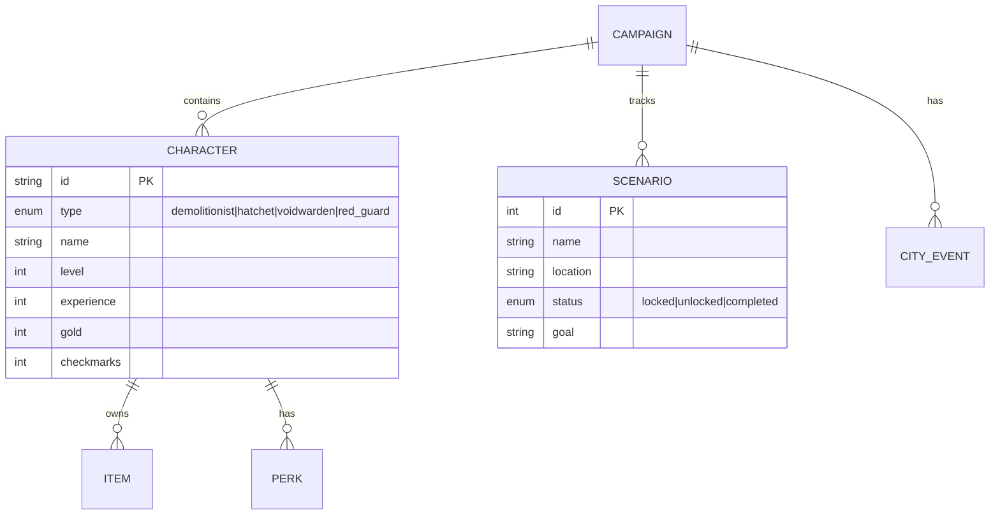

# Gloomhaven: Jaws of the Lion - Companion App Blueprint

> **Codename:** JotL Companion
> **Version:** 1.0.0
> **Last Updated:** 2026-02-04
> **Status:** Completed / Maintenance

---

## 0. Cold Start Context (READ THIS FIRST)

> **Purpose:** Quick orientation for the Architect AI when resuming after context loss.

### What Is This Project?
A **companion app** for the board game "Gloomhaven: Jaws of the Lion". It helps players track campaigns, characters, and look up rules — but does NOT simulate or replace the physical game.

### Current State (2026-02-04)
```
Phase 1: Foundation (COMPLETE)
  [x] Tasks 1-5: Scaffolding, Data, Database, Campaign Store, Character Creation

Phase 2: Core Features (COMPLETE)
  [x] Tasks 6-10: Character Detail, Perks, Scenario Tracker, Checklist, Calculators

Phase 3: Rules Reference (COMPLETE)
  [x] Tasks 11-14: Rules Data, Glossary, Reference Cards, Focus Helper

Phase 4: Polish (COMPLETE)
  [x] Tasks 15-20: PWA, Export/Import, UI Overhaul, Dashboard, Items, Polish
  [x] Task 21: UI Redesign (Home & Campaign Detail)
  [x] Stability Pass: Gold economy, resets, lazy loading, error boundaries
  [x] 1.0.0 Release: Licensing (GPLv3), In-app User Handbook, Branding
```

### Key Files to Read
| File | Purpose |
|------|---------|
| `BLUEPRINT.md` | You are here — architecture, roadmap, decisions |
| `README.md` | General project overview & setup |
| `src/features/settings/HandbookPage.tsx` | In-app user guide & manual |
| `src/features/campaign/store.ts` | Zustand store — single runtime authority |
| `src/data/index.ts` | Static game data barrel |
| `src/app/routes.tsx` | App routing structure |

### Tech Stack Summary
- **React 19** + TypeScript 5.9 (strict) + Vite 7
- **Tailwind CSS v4** (via `@tailwindcss/vite`, no PostCSS config)
- **Zod v4** — `import * as z from 'zod'`
- **Dexie 4** — IndexedDB wrapper, `db.campaigns` table
- **Zustand 5** — campaign store with manual Dexie sync
- **React Router 7** — nested layout routes + lazy loading
- **PWA** — `vite-plugin-pwa`, offline support, installable

---

## 1. Vision & Goals

### 1.1 Core Purpose
A companion app that **enhances** the physical board game experience without replacing it. Players still play the board game; this app handles:
- Campaign progress tracking
- Character management
- Rules reference & quick lookups
- Post-scenario checklists
- Calculations (scenario level, gold conversion, etc.)

### 1.2 Non-Goals
- **NOT** a digital version of the game
- **NOT** replacing physical components (cards, dice, etc.)
- **NOT** automating gameplay decisions

---

## 2. Game Domain Model



---

## 3. Application Architecture

### 3.1 Tech Stack
| Layer | Choice | Notes |
|-------|--------|-------|
| Framework | React 19 + Vite 7 | Latest stable |
| Language | TypeScript 5.9 | Strict mode |
| Styling | Tailwind CSS v4 | `@tailwindcss/vite` plugin |
| State | Zustand 5 | Single store; manual Dexie write-through |
| Storage | Dexie 4 (IndexedDB) | Offline-first, `src/shared/db/` |

### 3.2 Project Structure
```
src/
├── app/              # Entry point & Routes
├── features/         # Feature-based modules
│   ├── campaign/     # Campaign & Character UI
│   ├── rules/        # Glossary & Reference
│   ├── calculators/  # Scenario Setup
│   └── settings/     # Import/Export
├── shared/           # Cross-cutting concerns
│   ├── db/           # IndexedDB singleton
│   ├── schemas/      # Zod validation
│   └── components/   # UI kit
├── data/             # Static game rules (JSON)
└── styles/           # Tailwind globals
```

---

## 4. Architect's Log (History)

### 2026-02-03 — Foundation Phase Complete
- Tasks 1-5 implemented: Scaffolding, Static Data, DB, Store, Char Creation.

### 2026-02-04 — Core Features & Polish
- Tasks 6-21 implemented.
- **Key Milestones:**
  - Full Character Sheet (Stats, Perks, Items)
  - Scenario Tracker & Checklist
  - Rules Reference & Focus Helper
  - PWA Support & Offline Capability
  - Redesigned UI for v1.0.0
- **Stability Pass:** Fixed bugs in Item economy, PWA manifest, and error boundaries.
- **Release:** Version 1.0.0 prepared with GPLv3 license and User Handbook.

---

## 5. Technical Decisions (ADR Summary)

| ID | Decision | Rationale |
|----|----------|-----------|
| ADR-001 | React + Vite over Next.js | No SSR needed, simpler PWA setup |
| ADR-002 | IndexedDB via Dexie | Offline-first, typed queries, good TS support |
| ADR-003 | Zustand over Redux | Simpler API, persistence middleware |
| ADR-004 | Static JSON for game data | Immutable rules, no API, easy versioning |
| ADR-005 | Zod v4 | Runtime validation for untrusted DB/JSON data |
| ADR-006 | Embedded characters in Campaign | Avoids relational complexity for small dataset |
| ADR-007 | React.lazy code splitting | Optimizes load time for secondary routes |
| ADR-008 | useLoadedCampaign hook | Centralized hydration guard |

---

*End of Blueprint v1.0.0*