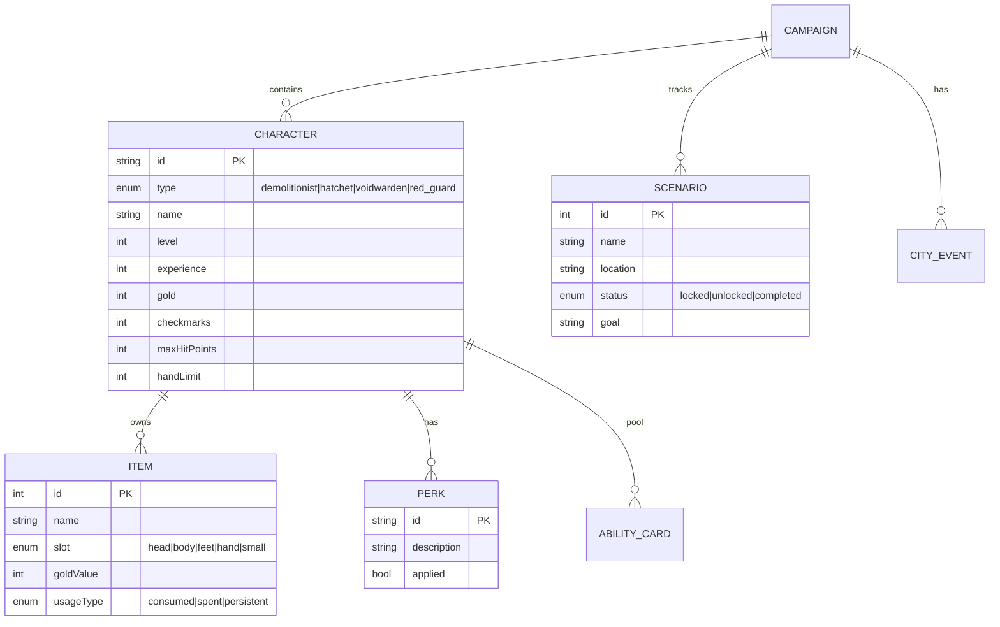
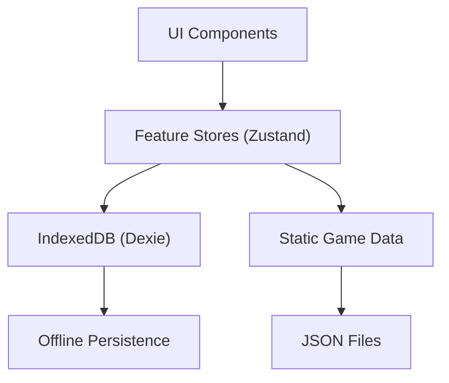

# Gloomhaven: Jaws of the Lion - Companion App Blueprint

> **Codename:** JotL Companion
> **Version:** 0.1.0
> **Last Updated:** 2026-02-03
> **Status:** Planning Phase

---

## 1. Vision & Goals

### 1.1 Core Purpose
A companion app that **enhances** the physical board game experience without replacing it. Players still play the board game; this app handles:
- Campaign progress tracking
- Character management
- Rules reference & quick lookups
- Post-scenario checklists
- Calculations (scenario level, gold conversion, etc.)

### 1.2 Non-Goals
- **NOT** a digital version of the game
- **NOT** replacing physical components (cards, dice, etc.)
- **NOT** automating gameplay decisions

---

## 2. Game Domain Model



### 2.1 Characters (4 Total)
| Character | Race | Role | Hand Limit |
|-----------|------|------|------------|
| Demolitionist | Quatryl | Melee Damage, Obstacle Destruction | 9 |
| Red Guard | Valrath | Protection, Monster Manipulation | 10 |
| Hatchet | Inox | Ranged Damage, Looting | 11 |
| Voidwarden | Human | Healing, Support | 11 |

### 2.2 Conditions (11 Total)
**Negative (6):** Poison, Wound, Stun, Disarm, Immobilize, Muddle, Curse
**Positive (2):** Strengthen, Bless

### 2.3 Elements (6)
Fire, Ice, Air, Earth, Light, Dark
States: Inert → Waning → Strong

---

## 3. Application Architecture

### 3.1 Tech Stack
- **Framework:** React + TypeScript + Vite
- **Styling:** Tailwind CSS v4 + shadcn/ui
- **State:** TanStack Query + Zustand (local persistence)
- **Validation:** Zod
- **Storage:** IndexedDB (via Dexie.js) for offline-first

### 3.2 Project Structure
```
src/
├── app/                    # App entry, routing
├── features/
│   ├── campaign/           # Campaign management
│   ├── characters/         # Character CRUD, leveling
│   ├── scenarios/          # Scenario tracking
│   ├── rules/              # Rules reference
│   └── calculators/        # Game calculators
├── shared/
│   ├── components/         # Reusable UI components
│   ├── hooks/              # Custom hooks
│   ├── lib/                # Utilities
│   └── types/              # TypeScript types & Zod schemas
├── data/                   # Static game data (JSON)
└── styles/                 # Global styles
```

### 3.3 Data Flow


---

## 4. Feature Modules

### 4.1 Campaign Management (`features/campaign/`)
- Create/delete campaigns
- Track active campaign
- Export/import campaign data (JSON)

### 4.2 Character Management (`features/characters/`)
- Create characters (select from 4 types)
- Track: level, XP, gold, checkmarks
- Manage perks (attack modifier deck changes)
- Manage items (slot restrictions)
- Calculate max HP by level

### 4.3 Scenario Tracker (`features/scenarios/`)
- List of 17 scenarios with unlock status
- Mark scenarios as completed
- Track scenario rewards
- Visual campaign map (optional v2)

### 4.4 Rules Reference (`features/rules/`)
- Searchable glossary
- Quick reference cards:
  - Movement rules
  - Line of sight
  - Attack resolution
  - Conditions reference
  - Element system
  - Monster focus algorithm

### 4.5 Calculators (`features/calculators/`)
- **Scenario Level:** `floor(avgCharLevel / 2) + difficultyModifier`
- **Trap Damage:** `scenarioLevel + 2`
- **Gold Conversion:** Based on scenario level table
- **Bonus XP:** Based on scenario level table

### 4.6 Post-Scenario Checklist (`features/scenarios/`)
Interactive checklist for:
- **Won:** Conclusion, rewards, battle goal, gold, XP, level up?, perks, items, city event
- **Lost:** XP, gold only

---

## 5. Data Models (Zod Schemas)

```typescript
// Character Types
const CharacterType = z.enum([
  'demolitionist', 'hatchet', 'voidwarden', 'red_guard'
]);

// Character Schema
const Character = z.object({
  id: z.string().uuid(),
  type: CharacterType,
  name: z.string().min(1).max(50),
  level: z.number().int().min(1).max(9),
  experience: z.number().int().min(0),
  gold: z.number().int().min(0),
  checkmarks: z.number().int().min(0).max(18),
  perks: z.array(z.string()), // perk IDs
  items: z.array(z.number()), // item IDs
});

// Scenario Status
const ScenarioStatus = z.enum(['locked', 'unlocked', 'completed']);

// Campaign Schema
const Campaign = z.object({
  id: z.string().uuid(),
  name: z.string(),
  characters: z.array(Character),
  scenarios: z.record(z.number(), ScenarioStatus),
  cityEventsDeck: z.array(z.number()),
  createdAt: z.string().datetime(),
  updatedAt: z.string().datetime(),
});
```

---

## 6. Implementation Roadmap

### Phase 1: Foundation (Tasks 1-5)
1. **[Task 1]** Project scaffolding (Vite + React + TS + Tailwind + shadcn) `DONE`
2. **[Task 2]** Static game data (characters, perks, items, scenarios)
3. **[Task 3]** Data layer (Zod schemas + Dexie DB)
4. **[Task 4]** Campaign CRUD + persistence
5. **[Task 5]** Character creation flow

### Phase 2: Core Features (Tasks 6-10)
6. **[Task 6]** Character detail view + editing
7. **[Task 7]** Level up workflow
8. **[Task 8]** Scenario tracker + status management
9. **[Task 9]** Post-scenario checklist (interactive)
10. **[Task 10]** Calculators (scenario level, gold, XP)

### Phase 3: Rules Reference (Tasks 11-14)
11. **[Task 11]** Rules data structure + content
12. **[Task 12]** Searchable glossary UI
13. **[Task 13]** Quick reference cards (conditions, elements)
14. **[Task 14]** Monster focus algorithm helper

### Phase 4: Polish (Tasks 15+)
15. **[Task 15]** PWA support (offline, installable)
16. **[Task 16]** Export/import campaigns
17. **[Task 17]** Dark mode + accessibility
18. **[Task 18]** Visual campaign map

---

## 7. Lookup Tables (Static Data)

### 7.1 Scenario Level Table
| Scenario Level | Monster Level | Trap Damage | Gold Conversion | Bonus XP |
|----------------|---------------|-------------|-----------------|----------|
| 0 | 0 | 2 | 2 | 4 |
| 1 | 1 | 3 | 2 | 6 |
| 2 | 2 | 4 | 3 | 8 |
| 3 | 3 | 5 | 3 | 10 |
| 4 | 4 | 6 | 4 | 12 |
| 5 | 5 | 7 | 4 | 14 |
| 6 | 6 | 8 | 5 | 16 |
| 7 | 7 | 9 | 6 | 18 |

### 7.2 Character Level Thresholds
| Level | XP Required | Perks from Levels |
|-------|-------------|-------------------|
| 1 | 0 | 0 |
| 2 | 45 | 1 |
| 3 | 95 | 2 |
| 4 | 150 | 3 |
| 5 | 210 | 4 |
| 6 | 275 | 5 |
| 7 | 345 | 6 |
| 8 | 420 | 7 |
| 9 | 500 | 8 |

### 7.3 Item Slot Limits
- Head: 1
- Body: 1
- Feet: 1
- Hand: 2
- Small: `ceil(characterLevel / 2)`

---

## 8. Architect's Log

### 2026-02-03 - Task 1 Complete
- Studied game documentation (Learn to Play, Glossary, Character Sheets)
- Defined core domain model and planned feature modules
- Created implementation roadmap
- Scaffolded Vite + React 19 + TS strict + Tailwind v4 + shadcn/ui
- Installed: zustand, dexie, zod, react-router-dom (basic "/" route live)
- `pnpm build` passes clean — zero TS errors
- **Note:** React 19 (latest stable) used instead of React 18 per "latest stable" rule
- **Note:** Zod v4 installed (latest stable); API differs from v3 — schemas in Task 3 will use v4
- **Note:** esbuild postinstall warning is cosmetic; binary works, pnpm 10 security gate
- **Next:** Task 2 - Static game data (JSON fixtures)

---

## 9. Technical Decisions Log (ADR Summary)

| ID | Decision | Rationale |
|----|----------|-----------|
| ADR-001 | React + Vite over Next.js | No SSR needed, simpler setup for PWA |
| ADR-002 | IndexedDB via Dexie | Offline-first, complex queries, good TS support |
| ADR-003 | Zustand over Redux | Simpler API, built-in persistence middleware |
| ADR-004 | Static JSON for game data | Immutable, easy to version, no API needed |

---

*End of Blueprint v0.1.0*
