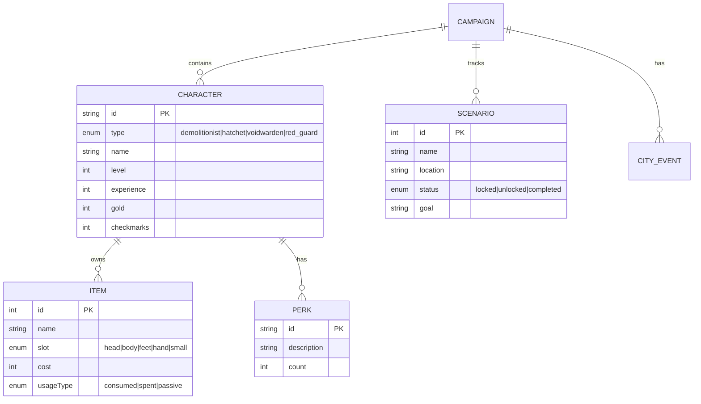
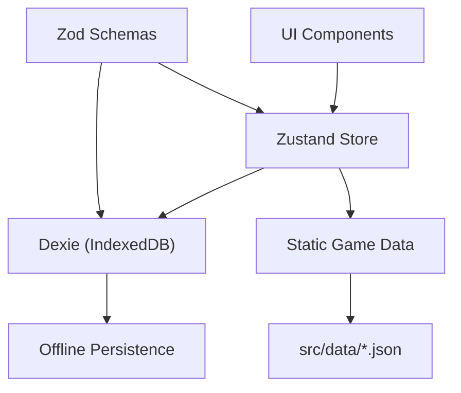

# Gloomhaven: Jaws of the Lion - Companion App Blueprint

> **Codename:** JotL Companion
> **Version:** 0.4.0
> **Last Updated:** 2026-02-04
> **Status:** Implementation Phase (Tasks 1-20 complete)

---

## 0. Cold Start Context (READ THIS FIRST)

> **Purpose:** Quick orientation for the Architect AI when resuming after context loss.

### What Is This Project?
A **companion app** for the board game "Gloomhaven: Jaws of the Lion". It helps players track campaigns, characters, and look up rules — but does NOT simulate or replace the physical game.

### Current State (2026-02-04)
```
Phase 1: Foundation
  [x] Task 1 — Scaffolding (Vite 7, React 19, TS strict, Tailwind v4, shadcn/ui)
  [x] Task 2 — Static game data (7 JSON fixtures in src/data/)
  [x] Task 3 — Data layer (Zod v4 schemas + Dexie DB)
  [x] Task 4 — Campaign CRUD + Zustand store
  [x] Task 5 — Character creation flow

Phase 2: Core Features (complete)
  [x] Task 6 — Character detail view + stat editing (XP/gold/checkmarks, auto-level)
  [x] Task 7 — Character perks (selection UI)
  [x] Task 8 — Scenario tracker + status management
  [x] Task 9 — Post-scenario checklist (interactive)
  [x] Task 10 — Calculators (scenario level, gold, XP)

Phase 3: Rules Reference (complete)
  [x] Task 11 — Rules data structure + content
  [x] Task 12 — Searchable glossary UI
  [x] Task 13 — Quick reference cards
  [x] Task 14 — Monster focus algorithm helper
```

### Key Files to Read
| File | Purpose |
|------|---------|
| `BLUEPRINT.md` | You are here — architecture, roadmap, decisions |
| `README.md` | Dev log, tech stack, git history |
| `docs/tasks/TASK-00*.md` | Completed task specs (001-006) |
| `src/features/campaign/store.ts` | Zustand store — single runtime authority for all campaign + character state |
| `src/features/campaign/*.tsx` | UI: CampaignList, CampaignDetail, CharacterCard, CharacterForm, CharacterDetail |
| `src/data/index.ts` | Static game data barrel (characters, perks, items, scenarios, tables) |
| `src/shared/schemas/index.ts` | Zod v4 schemas for Campaign, CharacterProgress |
| `src/shared/db/index.ts` | Dexie database singleton (`db.campaigns`) |
| `src/app/routes.tsx` | Routes: `/`, `/campaign/:id`, `/campaign/:campaignId/character/:characterId` |

### Tech Stack Summary
- **React 19** + TypeScript 5.9 (strict) + Vite 7
- **Tailwind CSS v4** (via `@tailwindcss/vite`, no PostCSS config)
- **Zod v4** — `import * as z from 'zod'` (not v3!)
- **Dexie 4** — IndexedDB wrapper, `db.campaigns` table; write-through from Zustand
- **Zustand 5** — campaign store at `src/features/campaign/store.ts`; manual Dexie sync (no persist middleware)
- **React Router 7** — 3 routes; param names: `:id` (campaign list→detail), `:campaignId` + `:characterId` (character detail)
- **pnpm** only (no npm/yarn)

### Game Domain Quick Reference
- **4 Characters:** Demolitionist, Red Guard, Hatchet, Voidwarden
- **17 Scenarios:** Linear unlock chain (1 → 2 → ... → 17)
- **9 Conditions:** Poison, Wound, Stun, Disarm, Immobilize, Muddle, Curse, Strengthen, Bless
- **6 Elements:** Fire, Ice, Air, Earth, Light, Dark
- **Character Progression:** Level 1-9, XP thresholds, perks (every level + every 3 checkmarks)

### Workflow Protocol
1. Read `docs/AI Development Handbook v2.0.md` for Architect/Constructor role separation
2. Architect writes task specs in `docs/tasks/TASK-NNN-*.md`
3. Constructor (or self) executes task, commits with descriptive message
4. Update BLUEPRINT.md Architect's Log + README.md Dev Log after each task

---

## 1. Vision & Goals

### 1.1 Core Purpose
A companion app that **enhances** the physical board game experience without replacing it. Players still play the board game; this app handles:
- Campaign progress tracking
- Character management
- Rules reference & quick lookups
- Post-scenario checklists
- Calculations (scenario level, gold conversion, etc.)

### 1.2 Non-Goals
- **NOT** a digital version of the game
- **NOT** replacing physical components (cards, dice, etc.)
- **NOT** automating gameplay decisions

---

## 2. Game Domain Model



### 2.1 Characters (4 Total)
| Character | Race | Role | Hand Limit | HP at L1 |
|-----------|------|------|------------|----------|
| Demolitionist | Quatryl | Melee Damage, Obstacle Destruction | 9 | 8 |
| Red Guard | Valrath | Protection, Monster Manipulation | 10 | 10 |
| Hatchet | Inox | Ranged Damage, Looting | 11 | 8 |
| Voidwarden | Human | Healing, Support | 11 | 6 |

### 2.2 Conditions (9 Total)
**Negative (7):** Poison, Wound, Stun, Disarm, Immobilize, Muddle, Curse
**Positive (2):** Strengthen, Bless

### 2.3 Elements (6)
Fire, Ice, Air, Earth, Light, Dark
States: Inert → Waning → Strong

---

## 3. Application Architecture

### 3.1 Tech Stack
| Layer | Choice | Notes |
|-------|--------|-------|
| Framework | React 19 + Vite 7 | Latest stable |
| Language | TypeScript 5.9 | Strict mode |
| Styling | Tailwind CSS v4 | `@tailwindcss/vite` plugin |
| UI | shadcn/ui | Configured in `components.json` |
| State | Zustand 5 | To be configured in Task 4 |
| Validation | Zod v4 | Runtime schemas in `src/shared/schemas/` |
| Storage | Dexie 4 (IndexedDB) | Offline-first, `src/shared/db/` |
| Routing | React Router 7 | Basic setup in `src/app/routes.tsx` |

### 3.2 Project Structure
```
src/
├── app/
│   ├── main.tsx              # Entry point
│   ├── App.tsx               # BrowserRouter wrapper
│   └── routes.tsx            # Route definitions
├── features/
│   ├── campaign/             # [Task 4+] Campaign CRUD
│   ├── characters/           # [Task 5+] Character management
│   ├── scenarios/            # [Task 8+] Scenario tracking
│   ├── rules/                # [Task 11+] Rules reference
│   └── calculators/          # [Task 10] Game calculators
├── shared/
│   ├── schemas/              # Zod v4 schemas (Campaign, CharacterProgress)
│   ├── db/                   # Dexie database (campaigns table)
│   ├── components/ui/        # shadcn/ui components
│   ├── hooks/                # Custom hooks
│   ├── lib/utils.ts          # cn() utility
│   └── types/index.ts        # Shared TS types
├── data/                     # Static JSON (7 fixtures + barrel)
│   ├── characters.json
│   ├── perks.json
│   ├── conditions.json
│   ├── elements.json
│   ├── scenarios.json
│   ├── tables.json
│   ├── items.json
│   ├── types.ts
│   └── index.ts
└── styles/
    └── globals.css           # Tailwind v4 + theme
```

### 3.3 Data Flow


---

## 4. Feature Modules

### 4.1 Campaign Management (`features/campaign/`)
- Create/delete campaigns
- Track active campaign
- Export/import campaign data (JSON)

### 4.2 Character Management (`features/characters/`)
- Create characters (select from 4 types)
- Track: level, XP, gold, checkmarks
- Manage perks (attack modifier deck changes)
- Manage items (slot restrictions)
- Calculate max HP by level

### 4.3 Scenario Tracker (`features/scenarios/`)
- List of 17 scenarios with unlock status
- Mark scenarios as completed
- Track scenario rewards
- Visual campaign map (optional v2)

### 4.4 Rules Reference (`features/rules/`)
- Searchable glossary
- Quick reference cards:
  - Movement rules
  - Line of sight
  - Attack resolution
  - Conditions reference
  - Element system
  - Monster focus algorithm

### 4.5 Calculators (`features/calculators/`)
- **Scenario Level:** `ceil(avgCharLevel / 2) + difficultyModifier`
- **Trap Damage:** `scenarioLevel + 2`
- **Gold Conversion:** Based on scenario level table
- **Bonus XP:** Based on scenario level table

### 4.6 Post-Scenario Checklist (`features/scenarios/`)
Interactive checklist for:
- **Won:** Conclusion, rewards, battle goal, gold, XP, level up?, perks, items, city event
- **Lost:** XP, gold only

---

## 5. Data Models

### 5.1 Static Game Data (`src/data/`)
Immutable JSON fixtures loaded at build time:
- `characters.json` — 4 characters, HP tables L1-9
- `perks.json` — 47 perks across characters
- `conditions.json` — 9 status effects
- `elements.json` — 6 elements with colours
- `scenarios.json` — 17 scenarios with unlock chain
- `tables.json` — XP thresholds, scenario level lookup
- `items.json` — 7 starter items

### 5.2 Player State (`src/shared/schemas/`)
Zod v4 schemas for mutable campaign/character data:

```typescript
// CharacterProgress — embedded in Campaign
CharacterProgressSchema = z.object({
  id: z.string().uuid(),
  type: z.enum(['demolitionist', 'red_guard', 'hatchet', 'voidwarden']),
  name: z.string().min(1).max(50),
  level: z.number().int().min(1).max(9),
  experience: z.number().int().min(0),
  gold: z.number().int().min(0),
  checkmarks: z.number().int().min(0).max(18),
  perkIds: z.array(z.string()),
  itemIds: z.array(z.number().int()),
})

// Campaign — top-level persisted entity
CampaignSchema = z.object({
  id: z.string().uuid(),
  name: z.string().min(1).max(100),
  createdAt: z.coerce.date(),
  updatedAt: z.coerce.date(),
  characters: z.array(CharacterProgressSchema).max(4),
  scenarioStatus: z.record(z.coerce.number(), ScenarioStatusSchema),
  cityEventsDrawn: z.array(z.number().int()),
})
```

### 5.3 Database (`src/shared/db/`)
Dexie v1 schema:
```typescript
campaigns: 'id, name, updatedAt'  // Primary key: id
```

---

## 6. Implementation Roadmap

### Phase 1: Foundation (Tasks 1-5)
1. **[Task 1]** Project scaffolding `DONE`
2. **[Task 2]** Static game data `DONE`
3. **[Task 3]** Data layer (Zod + Dexie) `DONE`
4. **[Task 4]** Campaign CRUD + Zustand store `DONE`
5. **[Task 5]** Character creation flow `DONE`

### Phase 2: Core Features (Tasks 6-10)
6. **[Task 6]** Character detail view + editing `DONE`
7. **[Task 7]** Character perks (selection UI) `DONE`
8. **[Task 8]** Scenario tracker + status management `DONE`
9. **[Task 9]** Post-scenario checklist (interactive) `DONE`
10. **[Task 10]** Calculators (scenario level, gold, XP)

### Phase 3: Rules Reference (Tasks 11-14)
11. **[Task 11]** Rules data structure + content `DONE`
12. **[Task 12]** Searchable glossary UI `DONE`
13. **[Task 13]** Quick reference cards (conditions, elements) `DONE`
14. **[Task 14]** Monster focus algorithm helper `DONE`

### Phase 4: Polish (Tasks 15+)
15. **[Task 15]** PWA support (offline, installable) `DONE`
16. **[Task 16]** Export/import campaigns `DONE`
17. **[Task 17]** UI/UX Overhaul (Layout & Navigation) `DONE`
18. **[Task 18]** Dashboard Redesign `DONE`
19. **[Task 19]** Item Management `DONE`
20. **[Task 20]** Character Sheet Polish `DONE`

---

## 7. Lookup Tables (Static Data)

### 7.1 Scenario Level Table
| Level | Trap Damage | Gold/Token | Bonus XP |
|-------|-------------|------------|----------|
| 0 | 2 | 2 | 4 |
| 1 | 3 | 2 | 6 |
| 2 | 4 | 3 | 8 |
| 3 | 5 | 3 | 10 |
| 4 | 6 | 4 | 12 |
| 5 | 7 | 4 | 14 |
| 6 | 8 | 5 | 16 |
| 7 | 9 | 6 | 18 |

### 7.2 Character Level Thresholds
| Level | XP Required |
|-------|-------------|
| 1 | 0 |
| 2 | 45 |
| 3 | 95 |
| 4 | 150 |
| 5 | 210 |
| 6 | 275 |
| 7 | 345 |
| 8 | 420 |
| 9 | 500 |

### 7.3 Item Slot Limits
- Head: 1, Body: 1, Feet: 1, Hand: 2
- Small: `ceil(characterLevel / 2)`

---

## 8. Architect's Log

### 2026-02-03 — Foundation Phase Complete

**Task 1: Project Scaffolding**
- Vite 7 + React 19 + TypeScript 5.9 strict
- Tailwind CSS v4 via `@tailwindcss/vite` (no PostCSS config needed)
- shadcn/ui configured: `components.json`, path aliases, `cn()` utility
- React Router 7 with "/" placeholder route
- Installed (not configured): Zustand 5, Dexie 4, Zod v4

**Task 2: Static Game Data**
- Created 7 JSON fixtures with full game data
- 4 characters with HP tables (L1-9), 47 perks, 9 conditions, 6 elements
- 17 scenarios with complete unlock chain, 7 starter items
- Typed barrel export via `src/data/index.ts`

**Task 3: Data Layer**
- Zod v4 schemas: `Campaign`, `CharacterProgress`, enums, primitives
- 19/19 validation tests pass (valid accept, invalid reject, coercion)
- Dexie database: `campaigns` table with indices
- Singleton `db` export ready for CRUD operations

**Notes:**
- React 19 used (latest stable) instead of originally planned React 18
- Zod v4 API: use `import * as z from 'zod'`
- esbuild warning is cosmetic (pnpm 10 security gate)

**Next:** Task 4 — Campaign CRUD + Zustand store  →  spec written at `docs/tasks/TASK-004-campaign-crud.md`

### 2026-02-04 — Task 4 Spec Published

- Architect spec: `docs/tasks/TASK-004-campaign-crud.md`
- Scope: Zustand store (manual Dexie sync), CampaignList + CampaignCard UI, route wiring, localStorage for `activeCampaignId`.
- Key decisions encoded in the task:
  - No Zustand `persist` middleware (Dexie is async → explicit write-through).
  - `activeCampaignId` in `localStorage` (single key; avoids DB_VERSION bump).
  - New campaign auto-unlocks Scenario 1 only.
  - Delete requires confirmation in UI.

### 2026-02-04 — Task 5 Spec Published

- Architect spec: `docs/tasks/TASK-005-character-creation.md`
- Scope: `addCharacter` / `removeCharacter` store actions, `CampaignDetail` page, `CharacterCard` + `CharacterForm` UI.
- Key decisions:
  - No duplicate-type restriction (game allows it; flexibility).
  - New character: level=1, experience=0, gold=0, empty perkIds/itemIds.
  - HP derived from static `characters.json` hitPoints table.
  - Form disabled when party is full (4/4).

### 2026-02-04 — Task 6 Spec Published

- Architect spec: `docs/tasks/TASK-006-character-detail.md`
- Scope: `updateCharacter` store action, `CharacterDetail` page with stat editors, CharacterCard click-to-navigate.
- Key decisions:
  - Level is auto-computed from XP thresholds (`computeLevelFromXp` helper).
  - Editable: XP, gold, checkmarks. Read-only: level, HP, perks count, items count.
  - Route: `/campaign/:campaignId/character/:characterId`.
  - Checkmarks capped at 18; shows "X perks earned" (floor(checkmarks/3)).

### 2026-02-04 — Task 7 Spec Published

- Architect spec: `docs/tasks/TASK-007-perk-selection.md`
- Scope: Perk selection UI in Character Detail, `PerkList` component.
- Implemented: Checkbox list, "Available/Total" points calculation (Level - 1 + Checks/3), filtering by character class.

### 2026-02-04 — Task 8 Spec Published

- Architect spec: `docs/tasks/TASK-008-scenario-tracker.md`
- Scope: `ScenarioTracker` component, `setScenarioStatus` action, auto-unlock logic.
- Implemented: Grid UI for 17 scenarios, auto-unlocking next scenarios on completion.

### 2026-02-04 — Task 9 Spec Published

- Architect spec: `docs/tasks/TASK-009-post-scenario-checklist.md`
- Scope: `PostScenarioChecklist` component, end-of-game guide.
- Implemented: Success/Failure steps, scenario level lookup for Bonus XP/Gold, money calculator.

### 2026-02-04 — Task 10 Spec Published

- Architect spec: `docs/tasks/TASK-010-calculators.md`
- Scope: `CalculatorPage` component for scenario setup.
- Implemented: Average level calculation, difficulty modifiers, scenario stats lookup (Trap Dmg, Gold, XP).

### 2026-02-04 — Task 11 Spec Published

- Architect spec: `docs/tasks/TASK-011-rules-data.md`
- Scope: Rules data structure for glossary, guides, and treasures.
- Implemented: `rules.json` with 95 terms, 4 guides, and 16 treasures; defined TS interfaces.

### 2026-02-04 — Task 12 Spec Published

- Architect spec: `docs/tasks/TASK-012-glossary-ui.md`
- Scope: `GlossaryPage` component with search, letter, and category filters.
- Implemented: 3-layer filtering system for 95 terms, Markdown-lite rendering, mobile-responsive layout.

### 2026-02-04 — Task 13 Spec Published

- Architect spec: `docs/tasks/TASK-013-reference-cards.md`
- Scope: `RulesLayout` with tab navigation and `ReferencePage` with visual cards.
- Implemented: Tabbed navigation, color-coded Condition cards (Pos/Neg), Element indicators, and Guide cards with rich formatting (bold, bullets).

### 2026-02-04 — Task 14 Spec Published

- Architect spec: `docs/tasks/TASK-014-monster-focus-helper.md`
- Scope: Interactive wizard for resolving monster focus.
- Implemented: 3-step algorithm (Movement → Proximity → Initiative), editable target table, and integration with active campaign party.

### 2026-02-04 — Task 15 Spec Published

- Architect spec: `docs/tasks/TASK-015-pwa-support.md`
- Scope: Transform the app into a Progressive Web App.
- Implemented: `vite-plugin-pwa` configuration, offline caching, manifest, and custom icon.

### 2026-02-04 — Task 16 Spec Published

- Architect spec: `docs/tasks/TASK-016-export-import.md`
- Scope: Backup and restore functionality.
- Implemented: JSON export/import with Zod schema validation in store and settings page.

### 2026-02-04 — Task 17 Spec Published

- Architect spec: `docs/tasks/TASK-017-ui-overhaul.md`
- Scope: Global layout and navigation.
- Implemented: `AppLayout`, `BottomNav`, and `SettingsPage`; centralized settings logic.

### 2026-02-04 — Task 18 Spec Published

- Architect spec: `docs/tasks/TASK-018-dashboard.md`
- Scope: Dashboard redesign with active campaign focus.
- Implemented: `ActiveCampaignCard`, `CreateCampaignCard` (inline), and sorted list layout.

### 2026-02-04 — Task 19 Spec Published

- Architect spec: `docs/tasks/TASK-019-item-management.md`
- Scope: Character inventory and shop UI.
- Implemented: `ItemManager` and `ItemShop` with slot validation and filtering.

### 2026-02-04 — Task 20 Spec Published

- Architect spec: `docs/tasks/TASK-020-character-sheet-polish.md`
- Scope: Unified character sheet UI.
- Implemented: Tabbed `CharacterDetail` view (Stats, Perks, Items) with sticky header and mobile optimizations.

---

## 9. Technical Decisions (ADR Summary)

| ID | Decision | Rationale |
|----|----------|-----------|
| ADR-001 | React + Vite over Next.js | No SSR needed, simpler PWA setup |
| ADR-002 | IndexedDB via Dexie | Offline-first, typed queries, good TS support |
| ADR-003 | Zustand over Redux | Simpler API, persistence middleware |
| ADR-004 | Static JSON for game data | Immutable rules, no API, easy versioning |
| ADR-005 | Zod v4 (not v3) | Latest stable, better tree-shaking |
| ADR-006 | Embedded characters in Campaign | Avoids relational complexity for small dataset |

---

*End of Blueprint v0.2.0*
