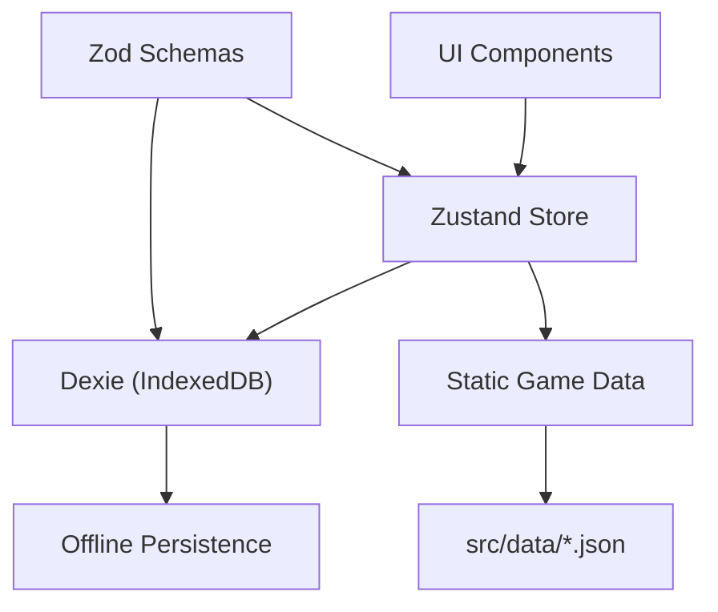

# TASK-004: Campaign CRUD + Zustand Store

**Status:** `DONE`
**Priority:** `HIGH`
**Complexity:** `MEDIUM`
**Depends On:** TASK-003 (complete)

---

## Goal

Wire up the first interactive feature: a Zustand store that owns campaign state, persists every mutation to Dexie, and a minimal list UI that lets the player create, select, and delete campaigns.

---

## Rules of Engagement

- UI is **functional-first**: dark theme, consistent with the existing scaffold palette (amber accent, zinc greys). No polish/animation scope.
- **No export/import** — that is Task 16.
- **No character management UI** — character cards inside a campaign are a placeholder only (Task 5).
- Build must pass (`pnpm build` — zero TS errors).
- `activeCampaignId` is persisted in `localStorage` (single key, avoids a DB schema bump).

---

## Context

### What exists (Tasks 1-3)

| Artifact | What it gives us |
|----------|-----------------|
| `src/shared/schemas/` | `Campaign`, `CreateCampaign` types + Zod schemas |
| `src/shared/db/` | `db` singleton — `db.campaigns` is a typed Dexie `EntityTable<Campaign, 'id'>` |
| `src/data/scenarios.json` | 17 scenarios; `id: 1` has `"unlockedBy": null` (always the first unlocked scenario) |
| `src/app/routes.tsx` | Single `"/"` placeholder route; comment says *"will be replaced in Task 04"* |
| `src/app/App.tsx` | `<BrowserRouter><AppRoutes /></BrowserRouter>` |
| `package.json` | `zustand ^5.0.11` already installed |

### Data-flow contract (from BLUEPRINT §3.3)



The store is the **single runtime authority**.  Dexie is write-through persistence.  The store hydrates from Dexie once on startup; every subsequent mutation is saved to Dexie before the promise resolves.

### New-campaign initial state (domain rule)

When a brand-new campaign is created only the **name** is supplied by the player.  Everything else is deterministic:

| Field | Initial value | Rationale |
|-------|---------------|-----------|
| `id` | `crypto.randomUUID()` | unique key |
| `createdAt` / `updatedAt` | `new Date()` | timestamps |
| `characters` | `[]` | added in Task 5 |
| `scenarioStatus` | `{ 1: 'unlocked', 2-17: 'locked' }` | Scenario 1 is always the entry point (`unlockedBy: null`) |
| `cityEventsDrawn` | `[]` | drawn during play |

---

## Files to Touch

```
NEW   src/features/campaign/store.ts          # Zustand store + Dexie sync helpers
NEW   src/features/campaign/CampaignList.tsx   # List view: create / list / delete / select
NEW   src/features/campaign/CampaignCard.tsx   # Single-campaign card (name, date, progress summary)
NEW   src/features/campaign/index.ts           # Barrel export

EDIT  src/app/routes.tsx                       # Replace placeholder; add /campaign/:id stub
EDIT  src/app/App.tsx                          # Call store.initStore() on mount
```

---

## Specifications

### 1. `src/features/campaign/store.ts`

Zustand 5 store.  **No** persist middleware — Dexie is async; sync is manual and explicit.

```typescript
import { create } from 'zustand'
import { db } from '@/shared/db'
import { CampaignSchema, type Campaign, type CreateCampaign, CreateCampaignSchema } from '@/shared/schemas'

// ---------------------------------------------------------------------------
// Shape
// ---------------------------------------------------------------------------
interface CampaignState {
  campaigns: Campaign[]
  activeCampaignId: string | null
  isLoaded: boolean                          // false until initStore() resolves
}

interface CampaignActions {
  /** Hydrate store from Dexie.  Called once at app boot. */
  initStore: () => Promise<void>

  /** Validate name → build full Campaign → persist → add to state. */
  createCampaign: (input: CreateCampaign) => Promise<void>

  /** Remove from Dexie, remove from state.  Clears active if it matches. */
  deleteCampaign: (id: string) => Promise<void>

  /** Persist choice to localStorage, update state. */
  setActiveCampaign: (id: string) => void
}

export type CampaignStore = CampaignState & CampaignActions
```

Implementation notes:
- `initStore`: `const rows = await db.campaigns.toArray()` → set `campaigns` + read `localStorage.getItem('jotl:activeCampaignId')`.
- `createCampaign`: validate with `CreateCampaignSchema.parse(input)`, build the full object (see *initial state* table above), `CampaignSchema.parse(full)` as a safety check before writing, `await db.campaigns.add(full)`, then `set(...)`.
- `deleteCampaign`: `await db.campaigns.delete(id)`, filter state, clear `activeCampaignId` + localStorage if it matches.
- `setActiveCampaign`: `localStorage.setItem('jotl:activeCampaignId', id)`, `set(...)`.
- The `localStorage` key is **`jotl:activeCampaignId`**.

### 2. `src/features/campaign/CampaignCard.tsx`

A single card.  Props:

```typescript
interface CampaignCardProps {
  campaign: Campaign
  isActive: boolean
  onSelect: () => void          // navigate to /campaign/:id + setActiveCampaign
  onDelete: () => void          // calls deleteCampaign after confirmation
}
```

Display:
- Campaign name (clickable — fires `onSelect`)
- `Created: <human-readable date>`  (use `toLocaleDateString()`)
- `Characters: X / 4`
- Next scenario label: derive from `scenarioStatus` — find the **first** key (numerically) whose value is `'unlocked'`.  Render as e.g. *"Next: Scenario 3 – The Black Ship"*.  Look up the name from the static `scenarios` data (`import { scenarios } from '@/data'`).
- A small "×" or trash icon **button** in the top-right corner that triggers `onDelete`.
- Visual distinction when `isActive` is true (e.g., a highlighted border).

### 3. `src/features/campaign/CampaignList.tsx`

Consumes the Zustand store.  Layout (top → bottom):

1. **Header** — "Your Campaigns" heading.
2. **Create form** — a single `<input>` for campaign name + a "Create" button.  Disabled while name is empty.  On submit: call `createCampaign({ name })`, clear input.  Show a brief error message if the promise rejects.
3. **Campaign grid** — map `campaigns` → `<CampaignCard>`.  If the array is empty, show a "No campaigns yet" message.
4. **Loading gate** — while `isLoaded === false` render a single "Loading…" text in place of the grid (Dexie hydration).

### 4. `src/features/campaign/index.ts`

```typescript
export { useCampaignStore } from './store'
export { CampaignList } from './CampaignList'
```

### 5. `src/app/routes.tsx`

```typescript
import { Routes, Route, Navigate } from 'react-router-dom'
import { CampaignList } from '@/features/campaign'

// Placeholder — fleshed out in Task 5 / Task 6
function CampaignDetailPage() {
  return (
    <div className="flex min-h-screen flex-col items-center justify-center">
      <p className="text-zinc-400">Campaign detail — coming in Task 005.</p>
    </div>
  )
}

export function AppRoutes() {
  return (
    <Routes>
      <Route path="/" element={<CampaignList />} />
      <Route path="/campaign/:id" element={<CampaignDetailPage />} />
    </Routes>
  )
}
```

### 6. `src/app/App.tsx`

Add a one-time `useEffect` that calls `initStore()`:

```typescript
import { useEffect } from 'react'
import { BrowserRouter } from 'react-router-dom'
import { AppRoutes } from './routes.tsx'
import { useCampaignStore } from '@/features/campaign'

export function App() {
  const initStore = useCampaignStore((s) => s.initStore)

  useEffect(() => {
    void initStore()
  }, [initStore])            // stable ref — never re-fires

  return (
    <BrowserRouter>
      <AppRoutes />
    </BrowserRouter>
  )
}
```

---

## Constraints

1. **DO NOT** touch any file outside the whitelist above.
2. **DO NOT** add character creation / editing logic (Task 5).
3. **DO NOT** bump `DB_VERSION` or change the Dexie schema — `campaigns` table is unchanged.
4. **DO NOT** use Zustand `persist` middleware — Dexie is async; sync is explicit.
5. **Import paths** must use the `@/` alias (`@/shared/…`, `@/data`, `@/features/…`).
6. **Zod v4** — `import * as z from 'zod'` if needed in this task (store file only).
7. The `deleteCampaign` action must require a **confirmation** step in the UI (e.g., `window.confirm` or inline confirm toggle on the card) before actually deleting.

---

## Acceptance Criteria

| # | Check |
|---|-------|
| 1 | `pnpm build` passes — zero TypeScript errors |
| 2 | `useCampaignStore` is exported from `@/features/campaign` |
| 3 | Creating a campaign persists to IndexedDB (verify in DevTools → Application → IndexedDB → `jotl-companion` → `campaigns`) |
| 4 | Deleting a campaign removes it from IndexedDB |
| 5 | Refreshing the page re-hydrates the campaign list from IndexedDB |
| 6 | New campaign starts with Scenario 1 unlocked, all others locked |
| 7 | `activeCampaignId` survives a page refresh (localStorage) |
| 8 | `/campaign/:id` route renders the placeholder without crashing |

---

## Verification Checklist (manual, in browser)

1. `pnpm dev` → open `http://localhost:5173`
2. See "No campaigns yet" (or "Loading…" briefly first).
3. Type a name → click Create → card appears.
4. Refresh → card still there (Dexie hydration works).
5. Click card → navigates to `/campaign/<uuid>` → sees placeholder.
6. Go back to `/` → click delete → confirm → card gone → refresh → still gone.
7. Open DevTools → Application → IndexedDB → verify table contents at each step.

---

## Reference

| Doc | Section |
|-----|---------|
| `BLUEPRINT.md` | §3.3 Data Flow, §4.1 Campaign Management, §9 ADR-003 (Zustand) |
| `src/shared/schemas/campaign.schema.ts` | `Campaign` + `CreateCampaignSchema` |
| `src/shared/db/database.ts` | `db.campaigns` EntityTable |
| `src/data/scenarios.json` | Scenario list (for "next scenario" label) |

---

*Task created: 2026-02-04*
*Architect: Claude Sonnet 4.5*
