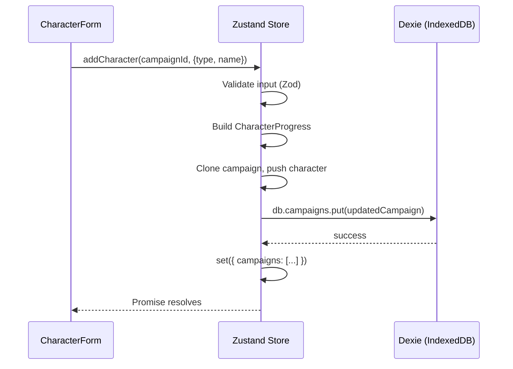

# TASK-005: Character Creation Flow

**Status:** `DONE`
**Priority:** `HIGH`
**Complexity:** `MEDIUM`
**Depends On:** TASK-004 (complete)

---

## Goal

Enable players to add and remove characters within a campaign. This replaces the `/campaign/:id` placeholder with a real detail page showing the character roster and an inline creation form.

---

## Rules of Engagement

- **No character editing/level-up** — that's Task 6-7.
- **No perk/item management** — characters start with empty arrays.
- **No duplicate-type restriction** — game allows it; keep flexibility.
- Delete requires confirmation (same pattern as campaign delete).
- Build must pass (`pnpm build` — zero TS errors).

---

## Context

### What exists (Tasks 1-4)

| Artifact | Purpose |
|----------|---------|
| `src/features/campaign/store.ts` | Zustand store with `campaigns[]`, `activeCampaignId`, CRUD for campaigns |
| `src/shared/schemas/character.schema.ts` | `CharacterProgressSchema` — validates character data |
| `src/data/characters.json` | 4 character definitions with `hitPoints` table (level → HP) |
| `src/app/routes.tsx` | `/campaign/:id` renders a placeholder `<CampaignDetailPage>` |

### Domain: New character initial state

When creating a character, the player supplies **type** + **name**. Everything else is deterministic:

| Field | Value | Rationale |
|-------|-------|-----------|
| `id` | `crypto.randomUUID()` | unique key |
| `type` | player selection | one of the 4 character IDs |
| `name` | player input (1-50 chars) | custom display name |
| `level` | `1` | everyone starts at L1 |
| `experience` | `0` | no XP yet |
| `gold` | `0` | no starting gold in JotL |
| `checkmarks` | `0` | no battle goals completed |
| `perkIds` | `[]` | perks are earned later |
| `itemIds` | `[]` | items purchased later |

### Domain: Max HP lookup

`characters.json` provides `hitPoints: Record<string, number>` where keys are level strings ("1"-"9"). To display current HP:

```typescript
import { characters } from '@/data'

const charDef = characters.find(c => c.id === progress.type)
const maxHp = charDef?.hitPoints[String(progress.level)] ?? 0
```

---

## Files to Touch

```
EDIT  src/features/campaign/store.ts           # Add addCharacter, removeCharacter actions
NEW   src/features/campaign/CampaignDetail.tsx # Campaign detail page
NEW   src/features/campaign/CharacterCard.tsx  # Single character display
NEW   src/features/campaign/CharacterForm.tsx  # Inline form: type selector + name input
EDIT  src/features/campaign/index.ts           # Export CampaignDetail
EDIT  src/app/routes.tsx                       # Wire CampaignDetail to /campaign/:id
```

---

## Specifications

### 1. `src/features/campaign/store.ts` — New Actions

Extend `CampaignActions` interface:

```typescript
interface CampaignActions {
  // ... existing actions ...

  /** Add a character to a campaign (max 4).  Updates Dexie + state. */
  addCharacter: (campaignId: string, input: CreateCharacter) => Promise<void>

  /** Remove a character from a campaign.  Updates Dexie + state. */
  removeCharacter: (campaignId: string, characterId: string) => Promise<void>
}
```

**CreateCharacter input type** (define locally in store or in schemas):

```typescript
interface CreateCharacter {
  type: 'demolitionist' | 'red_guard' | 'hatchet' | 'voidwarden'
  name: string
}
```

**addCharacter implementation:**
1. Find the campaign in state.
2. Validate input with Zod (type enum + name 1-50 chars).
3. Check `campaign.characters.length < 4` — throw if at limit.
4. Build full `CharacterProgress` object (see initial state table).
5. Validate with `CharacterProgressSchema.parse(...)`.
6. Clone the campaign, push the new character, bump `updatedAt`.
7. `await db.campaigns.put(updatedCampaign)` — full replace.
8. Update state.

**removeCharacter implementation:**
1. Find the campaign in state.
2. Filter out the character by ID.
3. Bump `updatedAt`.
4. `await db.campaigns.put(updatedCampaign)`.
5. Update state.

### 2. `src/features/campaign/CharacterCard.tsx`

Props:

```typescript
interface CharacterCardProps {
  character: CharacterProgress
  onDelete: () => void
}
```

Display:
- **Type badge**: Character class name (e.g., "Hatchet") — lookup from `characters` data.
- **Name**: Player-given name (larger, prominent).
- **Stats row**: `Level X • HP Y` where Y is derived from static `hitPoints` table.
- **Delete button**: "×" in corner, triggers confirm toggle (same pattern as CampaignCard).

Color hint: Each character type could have a subtle accent color, but for Task 5 keep it simple — use amber for all. Color theming is polish scope.

### 3. `src/features/campaign/CharacterForm.tsx`

Props:

```typescript
interface CharacterFormProps {
  /** Disable the form when campaign already has 4 characters */
  disabled: boolean
  onAdd: (input: CreateCharacter) => Promise<void>
}
```

Layout:
1. **Type selector**: 4 buttons (one per character type). Clicking selects that type (highlight the selected one). Show character name + race (e.g., "Hatchet (Inox)").
2. **Name input**: Text field, placeholder "Character name…", max 50 chars.
3. **Add button**: Disabled until both type is selected AND name is non-empty. Label: "Add Character".
4. **Error display**: Inline error if `onAdd` rejects.

When `disabled` is true (4 characters), show a message like "Party is full (4/4)" instead of the form.

### 4. `src/features/campaign/CampaignDetail.tsx`

This is the main page component for `/campaign/:id`.

**Data loading:**
- Get `id` from `useParams()`.
- Get `campaigns` from store.
- Find the campaign: `campaigns.find(c => c.id === id)`.
- If not found (deleted or invalid URL), show "Campaign not found" + link to `/`.

**Layout (top → bottom):**
1. **Header row**:
   - Back link: "← Back to campaigns" (navigates to `/`).
   - Campaign name (large heading).
2. **Characters section**:
   - Heading: "Party (X/4)" where X = character count.
   - If characters exist: grid/stack of `<CharacterCard>` components.
   - If empty: "No characters yet — add your first hero below."
3. **Add character section**:
   - `<CharacterForm disabled={characters.length >= 4} onAdd={...} />`

**Handlers:**
- `handleAddCharacter`: calls `store.addCharacter(campaign.id, input)`.
- `handleRemoveCharacter(charId)`: calls `store.removeCharacter(campaign.id, charId)`.

### 5. `src/features/campaign/index.ts` — Update Barrel

```typescript
export { useCampaignStore } from './store'
export { CampaignList } from './CampaignList'
export { CampaignDetail } from './CampaignDetail'
```

### 6. `src/app/routes.tsx` — Wire Detail Page

Replace the placeholder:

```typescript
import { CampaignList, CampaignDetail } from '@/features/campaign'

export function AppRoutes() {
  return (
    <Routes>
      <Route path="/" element={<CampaignList />} />
      <Route path="/campaign/:id" element={<CampaignDetail />} />
    </Routes>
  )
}
```

---

## Constraints

1. **DO NOT** implement character editing (XP, gold, level changes) — Task 6.
2. **DO NOT** implement level-up workflow — Task 7.
3. **DO NOT** add perk or item management UI.
4. **DO NOT** enforce unique character types per campaign.
5. **DO NOT** bump `DB_VERSION` — schema is unchanged (characters are embedded in Campaign).
6. Use `@/` import aliases everywhere.
7. Maintain dark theme consistency (zinc backgrounds, amber accents).

---

## Acceptance Criteria

| # | Check |
|---|-------|
| 1 | `pnpm build` passes — zero TypeScript errors |
| 2 | `/campaign/:id` renders `CampaignDetail` (not placeholder) |
| 3 | Adding a character persists to IndexedDB (verify in DevTools) |
| 4 | Removing a character persists to IndexedDB |
| 5 | Page refresh preserves character roster |
| 6 | Cannot add more than 4 characters (form disabled at limit) |
| 7 | New character starts with level=1, experience=0, gold=0, empty arrays |
| 8 | HP display matches static `characters.json` hitPoints for level 1 |
| 9 | Back link navigates to campaign list |
| 10 | Invalid campaign ID shows "not found" state |

---

## Verification Checklist (manual, in browser)

1. `pnpm dev` → create a campaign → click it → see detail page.
2. No characters initially → see empty state message.
3. Select "Hatchet" → enter name "Grunk" → click Add → card appears.
4. Card shows: "Hatchet", "Grunk", "Level 1 • HP 8".
5. Refresh → character still there.
6. Add 3 more characters → form shows "Party is full (4/4)".
7. Delete one → form reappears → can add again.
8. Navigate back to list → campaign card shows "Characters: 4 / 4".
9. Open DevTools → IndexedDB → `jotl-companion` → verify `characters` array in campaign.

---

## Reference

| Doc | Section |
|-----|---------|
| `BLUEPRINT.md` | §2.1 Characters, §4.2 Character Management, §5.2 Player State |
| `src/shared/schemas/character.schema.ts` | `CharacterProgressSchema` |
| `src/data/characters.json` | Static character definitions + HP tables |

---

## Mermaid: Data Flow



---

*Task created: 2026-02-04*
*Architect: Claude Opus 4.5*
