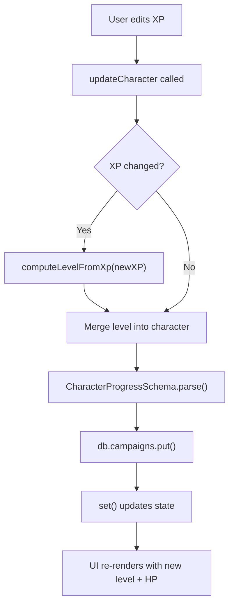

# TASK-006: Character Detail View + Editing

**Status:** `DONE`
**Priority:** `HIGH`
**Complexity:** `MEDIUM`
**Depends On:** TASK-005 (complete)

---

## Goal

Create a character detail page where players can view and edit character stats (XP, gold, checkmarks). Level is auto-computed from XP thresholds — when XP crosses a threshold, level updates automatically.

---

## Rules of Engagement

- **No perk management UI** — perks are displayed (count only) but not selectable yet.
- **No item management UI** — items are out of scope until later tasks.
- **Level is read-only** — derived from XP thresholds, auto-updated on XP change.
- **Checkmarks cap at 18** — per game rules.
- Build must pass (`pnpm build` — zero TS errors).

---

## Context

### What exists (Tasks 1-5)

| Artifact | Purpose |
|----------|---------|
| `src/features/campaign/store.ts` | `addCharacter`, `removeCharacter`; no generic update yet |
| `src/features/campaign/CharacterCard.tsx` | Displays character in roster; has delete but no click-to-detail |
| `src/data/tables.json` | `levelThresholds` — XP required for each level (1-9) |
| `src/shared/schemas/character.schema.ts` | `CharacterProgressSchema` with all field validations |

### Domain: XP → Level computation

From `tables.json`:
```json
{
  "1": 0, "2": 45, "3": 95, "4": 150,
  "5": 210, "6": 275, "7": 345, "8": 420, "9": 500
}
```

Level is the **highest** threshold that `experience >= threshold`. Example:
- 0 XP → Level 1
- 44 XP → Level 1
- 45 XP → Level 2
- 500 XP → Level 9

When `experience` is updated, recompute and store `level`.

### Domain: Checkmarks

Battle goals award checkmarks (0-18 max). Every 3 checkmarks → 1 perk unlock. The perk selection UI is Task 7 scope; here we just track the count.

---

## Files to Touch

```
EDIT  src/features/campaign/store.ts            # Add updateCharacter action + level computation helper
NEW   src/features/campaign/CharacterDetail.tsx # Character detail page with stat editors
EDIT  src/features/campaign/CharacterCard.tsx   # Add onSelect prop for navigation
EDIT  src/features/campaign/CampaignDetail.tsx  # Pass onSelect to CharacterCard
EDIT  src/features/campaign/index.ts            # Export CharacterDetail
EDIT  src/app/routes.tsx                        # Add nested route /campaign/:id/character/:charId
```

---

## Specifications

### 1. `src/features/campaign/store.ts` — New Action + Helper

**Level computation helper** (module-level function):

```typescript
import { tables } from '@/data'

/** Derive level from cumulative XP using the level thresholds table. */
function computeLevelFromXp(experience: number): number {
  const thresholds = tables.levelThresholds as Record<string, number>
  for (let level = 9; level >= 1; level--) {
    if (experience >= thresholds[String(level)]) {
      return level
    }
  }
  return 1
}
```

**UpdateCharacterInput interface:**

```typescript
export interface UpdateCharacterInput {
  experience?: number
  gold?: number
  checkmarks?: number
}
```

**Action signature** (add to `CampaignActions`):

```typescript
/** Update character stats.  Auto-recomputes level when XP changes. */
updateCharacter: (
  campaignId: string,
  characterId: string,
  updates: UpdateCharacterInput
) => Promise<void>
```

**Implementation:**
1. Find campaign and character in state (throw if not found).
2. Merge updates into character: `{ ...character, ...updates }`.
3. If `experience` was updated, recompute `level` using `computeLevelFromXp()`.
4. Validate merged character with `CharacterProgressSchema.parse()`.
5. Clone campaign, replace character in array, bump `updatedAt`.
6. `await db.campaigns.put(updatedCampaign)`.
7. Update state.

### 2. `src/features/campaign/CharacterCard.tsx` — Add `onSelect`

Extend props:

```typescript
interface CharacterCardProps {
  character: CharacterProgress
  onSelect: () => void   // NEW — navigate to detail
  onDelete: () => void
}
```

Make the main content area clickable:
- Wrap the type badge + name + stats in a `<button>` or clickable `<div>` that calls `onSelect`.
- Keep the delete "×" button separate (should NOT trigger `onSelect`).
- Add hover state to indicate clickability.

### 3. `src/features/campaign/CampaignDetail.tsx` — Pass `onSelect`

Update the `CharacterCard` usage:

```typescript
import { useNavigate } from 'react-router-dom'

// inside component:
const navigate = useNavigate()

<CharacterCard
  key={char.id}
  character={char}
  onSelect={() => navigate(`/campaign/${campaign.id}/character/${char.id}`)}
  onDelete={() => removeCharacter(campaign.id, char.id)}
/>
```

### 4. `src/features/campaign/CharacterDetail.tsx`

New page component for `/campaign/:campaignId/character/:characterId`.

**Data loading:**
- Get `campaignId` and `characterId` from `useParams()`.
- Find campaign, then find character within it.
- Handle loading state (`isLoaded`) and not-found states.

**Layout (top → bottom):**

1. **Back link**: "← Back to {campaignName}" — navigates to `/campaign/:campaignId`.

2. **Header**:
   - Character type badge (e.g., "Hatchet") from static data.
   - Player name (large heading).
   - Race in parentheses (e.g., "(Inox)").

3. **Stats section** — 2-column grid on wider screens:
   - **Level** (read-only): Display with HP. "Level 3 • HP 11".
   - **XP**: Progress bar + editable input.
     - Show "X / Y XP" where Y is next level threshold (or "MAX" at L9).
     - Number input to set XP directly.
   - **Gold**: Number input (min 0).
   - **Checkmarks**: Number input (min 0, max 18).
     - Show "X / 18 checkmarks • Y perks earned" where Y = floor(X / 3).

4. **Perks summary** (read-only for now):
   - "Perks: X selected" (count of `perkIds` array).
   - Note: "Perk selection coming soon" if count is 0.

5. **Items summary** (read-only placeholder):
   - "Items: X owned" (count of `itemIds` array).
   - Note: "Item management coming soon" if count is 0.

**Handlers:**
- `handleUpdateXp(value: number)`: calls `updateCharacter(campaignId, characterId, { experience: value })`.
- `handleUpdateGold(value: number)`: calls `updateCharacter(...)`.
- `handleUpdateCheckmarks(value: number)`: calls `updateCharacter(...)`.

**Input validation in UI:**
- XP: min 0, no max (but L9 at 500 XP is effectively max level).
- Gold: min 0.
- Checkmarks: min 0, max 18.

### 5. `src/features/campaign/index.ts` — Update Barrel

```typescript
export { CharacterDetail } from './CharacterDetail'
```

### 6. `src/app/routes.tsx` — Add Nested Route

```typescript
import { CampaignList, CampaignDetail, CharacterDetail } from '@/features/campaign'

export function AppRoutes() {
  return (
    <Routes>
      <Route path="/" element={<CampaignList />} />
      <Route path="/campaign/:id" element={<CampaignDetail />} />
      <Route path="/campaign/:campaignId/character/:characterId" element={<CharacterDetail />} />
    </Routes>
  )
}
```

---

## Constraints

1. **DO NOT** implement perk selection UI (Task 7).
2. **DO NOT** implement item management UI.
3. **DO NOT** allow direct level editing — level is derived from XP.
4. **DO NOT** bump `DB_VERSION` — schema is unchanged.
5. Maintain dark theme consistency (zinc backgrounds, amber accents).
6. Use `@/` import aliases everywhere.

---

## Acceptance Criteria

| # | Check |
|---|-------|
| 1 | `pnpm build` passes — zero TypeScript errors |
| 2 | Clicking a CharacterCard navigates to `/campaign/:id/character/:charId` |
| 3 | CharacterDetail page shows all stats (level, HP, XP, gold, checkmarks) |
| 4 | Editing XP persists to IndexedDB |
| 5 | Editing XP auto-updates level when threshold is crossed |
| 6 | Editing gold persists to IndexedDB |
| 7 | Editing checkmarks persists (capped at 18) |
| 8 | Page refresh preserves edited values |
| 9 | Back link returns to campaign detail |
| 10 | Invalid character ID shows "not found" state |

---

## Verification Checklist (manual, in browser)

1. Create a campaign + add a character (e.g., "Hatchet" named "Grunk").
2. Click the character card → navigates to detail page.
3. See: Level 1, HP 8, XP 0, Gold 0, Checkmarks 0.
4. Set XP to 44 → level stays 1.
5. Set XP to 45 → level becomes 2, HP updates to 9.
6. Set XP to 500 → level becomes 9.
7. Set gold to 50 → refresh → still 50.
8. Set checkmarks to 6 → shows "2 perks earned".
9. Try setting checkmarks to 20 → capped at 18.
10. Click back link → returns to campaign with updated stats visible on card.

---

## Mermaid: XP → Level Flow



---

## Reference

| Doc | Section |
|-----|---------|
| `BLUEPRINT.md` | §4.2 Character Management, §7.2 Character Level Thresholds |
| `src/data/tables.json` | `levelThresholds` object |
| `src/shared/schemas/character.schema.ts` | `CharacterProgressSchema` validations |

---

*Task created: 2026-02-04*
*Architect: Claude Opus 4.5*
